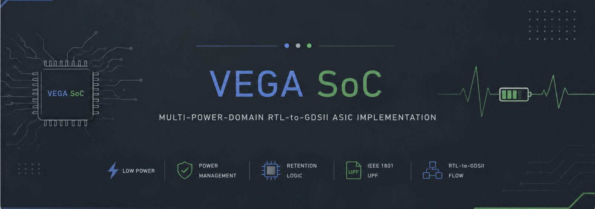
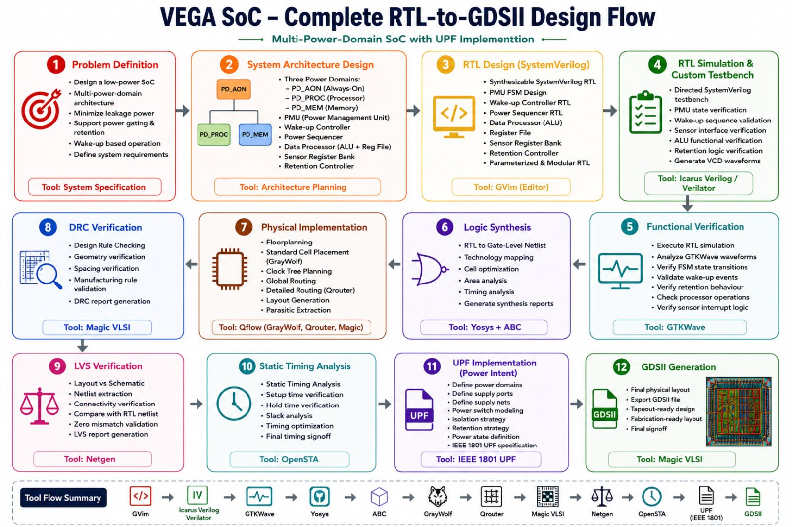

  

# VEGA SoC - Multi-Power-Domain RTL-to-GDSII ASIC Implementation

A low-power multi-power-domain System-on-Chip (SoC) designed using SystemVerilog and implemented through a complete RTL-to-GDSII ASIC design flow using open-source EDA tools with IEEE 1801 UPF implementation.

---

## Overview

**VEGA SoC** consists of three independent power domains:

- **PD_AON** (Always-On): PMU, Wake-up Controller, Power Sequencer
- **PD_PROC** (Processor): Data Processor (ALU), Register File
- **PD_MEM** (Memory): Sensor Register Bank, Retention Controller

The processor and memory domains can be powered down to reduce leakage power while the always-on domain monitors wake-up events.

---

## Key Features

- Multi-Power-Domain Architecture
- Power Gating & Retention Logic
- Low-Power Design with PMU
- Power Sequencer for controlled power transitions
- IEEE 1801 UPF Implementation
- Complete RTL-to-GDSII Flow
- Manufacturable GDSII Layout
- Full Functional & Physical Verification

---

## Complete Design Flow

## RTL-to-GDSII Design Flow

  

### Stage 1: Problem Definition
- Design a low-power SoC with multi-power-domain architecture
- Minimize leakage power with power gating & retention
- Support power gating & retention
- Define system requirements

**Tool:** System Specification

### Stage 2: System Architecture Design
**Power Domains:**
- PD_AON (Always-On): PMU FSM, Wake-up Controller, Power Sequencer
- PD_PROC (Processor): Data Processor (ALU), Register File
- PD_MEM (Memory): Sensor Register Bank, Retention Controller

**Tool:** Architecture Planning

### Stage 3: RTL Design (SystemVerilog)
- Synthesizable SystemVerilog RTL
- PMU FSM Design
- Wake-up Controller RTL
- Power Sequencer RTL
- Data Processor (ALU)
- Register File
- Sensor Register Bank
- Retention Controller
- Parametrized & Modular RTL

**Tool:** GVim (Editor)

### Stage 4: RTL Simulation & Custom Testbench
- Directed SystemVerilog testbench
- Full state verification
- Wake-up sequence validation
- Sensor interface verification
- ALU functional verification
- Retention logic verification
- Generate VCD waveforms

**Tool:** Icarus Verilog / Verilator

### Stage 5: Functional Verification
- Execute RTL simulation
- Analyze GTKWave waveforms
- Verify FSM state transitions
- Validate wake-up events
- Verify retention behavior
- Check processor operations
- Verify sensor interrupt logic

**Tool:** GTKWave

### Stage 6: Logic Synthesis
- RTL to Gate-level Netlist
- Technology mapping
- Cell optimization
- Area analysis
- Timing analysis
- Generate synthesis reports

**Tool:** Yosys + ABC

### Stage 7: Physical Implementation
- Floorplanning
- Standard Cell Placement
- GrayWolf placement
- Clock Tree Planning
- Global Routing
- Detailed Routing (Qrouter)
- Layout Generation
- Parasitic Extraction

**Tool:** Qflow (GrayWolf, Qrouter, Magic)

### Stage 8: DRC Verification
- Design Rule Checking
- Geometry verification
- Spacing verification
- Manufacturing rule validation
- DRC report generation

**Tool:** Magic VLSI

### Stage 9: LVS Verification
- Layout vs Schematic verification
- Netlist extraction
- Connectivity verification
- Compare with RTL netlist
- Zero mismatch validation
- LVS report generation

**Tool:** Netgen

### Stage 10: Static Timing Analysis
- Static Timing Analysis
- Setup time verification
- Hold time verification
- Slack analysis
- Timing optimization
- Final timing signoff

**Tool:** OpenSTA

### Stage 11: UPF Implementation (Power Intent)
- Define power domains
- Define supply ports
- Define supply nets
- Power switch modeling
- Isolation strategy
- Retention strategy
- Power state definition
- IEEE 1801 UPF specification

**Tool:** IEEE 1801 UPF

### Stage 12: GDSII Generation
- Final physical layout
- Export GDSII file
- Tape-out ready layout
- Fabrication-ready layout
- Final signoff

**Tool:** Magic VLSI

---

## EDA Tools Stack

| Phase | Tool |
|-------|------|
| Design & Simulation | GVim, Icarus Verilog, Verilator, GTKWave |
| Synthesis | Yosys, ABC |
| P&R | GrayWolf, Qrouter, Magic VLSI |
| Verification | Netgen, OpenSTA |
| Integration | Qflow |

## Future Enhancements

- Clock Gating
- DVFS Implementation
- Formal Verification
- OpenROAD Integration
- Silicon Tapeout
